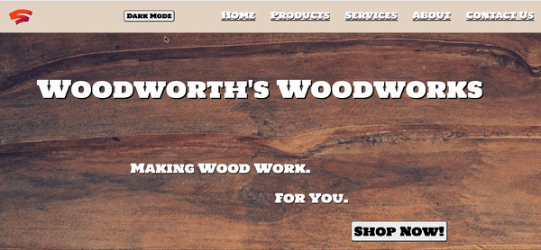

# Woodworth's Woodworks

## Description
  This one page sample company site was built using straight HTML, CSS, and JS (with a small amount of Bootstrap for the product grid). The navigation links and the Shop Now! button take the user to the different sections of the page. Hovering over a product will display the description for that product. Submitting information in the Contact Us form will log that information to the console. The Dark Mode/Light Mode button changes the colors of the background and text, and follows the user down the page for ease of use.

## Table of Contents
- [Installation](#installation)
- [License](#license)
- [Contributing](#contributing)
- [Questions](#questions)

## Installation
Nothing to install. To view the page, simply open the index.html file in any browser.

## License
  

Copyright 2021 Mathew Lundin

Permission is hereby granted, free of charge, to any person obtaining a copy of this software and associated documentation files (the "Software"), to deal in the Software without restriction, including without limitation the rights to use, copy, modify, merge, publish, distribute, sublicense, and/or sell copies of the Software, and to permit persons to whom the Software is furnished to do so, subject to the following conditions:

The above copyright notice and this permission notice shall be included in all copies or substantial portions of the Software.

THE SOFTWARE IS PROVIDED "AS IS", WITHOUT WARRANTY OF ANY KIND, EXPRESS OR IMPLIED, INCLUDING BUT NOT LIMITED TO THE WARRANTIES OF MERCHANTABILITY, FITNESS FOR A PARTICULAR PURPOSE AND NONINFRINGEMENT. IN NO EVENT SHALL THE AUTHORS OR COPYRIGHT HOLDERS BE LIABLE FOR ANY CLAIM, DAMAGES OR OTHER LIABILITY, WHETHER IN AN ACTION OF CONTRACT, TORT OR OTHERWISE, ARISING FROM, OUT OF OR IN CONNECTION WITH THE SOFTWARE OR THE USE OR OTHER DEALINGS IN THE SOFTWARE.

  [MIT License](https://opensource.org/licenses/MIT)
    

## Contributing
Mat Lundin built this page without assistance.

## Questions
Any questions can be submitted to Mat Lundin via email.

You can access this repository [here.](https://github.com/mat-lundin/DRS-takehome)

